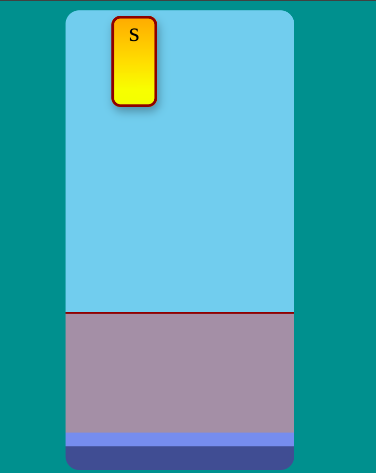

## Assignment

I got the idea and then I searched Google for images so that I can take inspiration from. This was how I made the resources. Keyboard game preview:

## Challenge

- To implement highscore, I used localStorage.get and set item to a current score if it is less than the stored highscore.
- To remove the event listener, I simply removed the event listener from the typedValueElement and re-added it after button press. 
- To display the modal dialog box, I simply used the alert function as we don't need any other custom UI or styles.
- To disable the text box, I changed the disabled attribute to true;